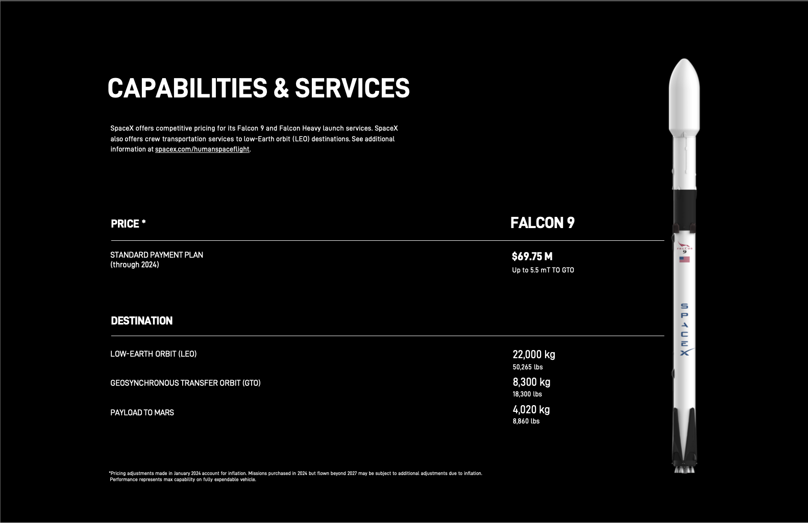

# Level 3: Going Multimodal

This level was only interactively shown during the presentation. Prompts were made in the LangSmith Playground and in the Google Cloud Console using the Gemini models.

The image at `data/falcon/Capabilities&Services.png` was used in the prompt:

